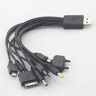

# Adapter

也称为 **Wrapper**.

通过包裹现有的类, 使其适配新的接口.

不用改动现有的代码就能使两个系统之间相互吻合.

```plain
class A+--->adapter interface C  +----->  function call(C ) {}
                ^
  class B+------+

```

## 现实例子


多头充电适配器的一头是 usb 接口, 另外一头有多个接口, 可以
适配不同型号手机的充电线.

## 编程例子

很多语言中, 都可以把 Collection 转为 list 对象:

```dart
var gen = gene();/// a generator
var list = gen.toList();
```

---

编程的本质是用计算机能够理解的语言描述事情如何运作.
很多思想来源于现实中的实际情境.

Adapter 类似于翻译, 与下图相比较:
